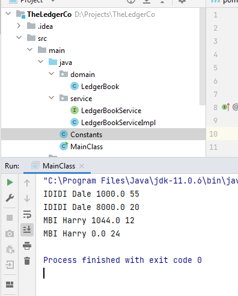
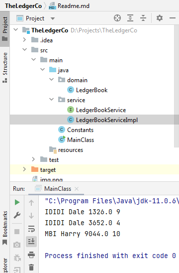
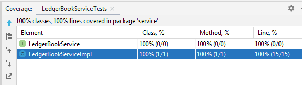

### Features

- Domain layer contains LedgerBook class with contains all the key characteristics of ledger calculation
- Service layer contains LedgerBookService interface and its implementation
- In order to run the application, file path needs to be passed in the argument list.
- Execute the main method inside MainClass to run the program
- Resources contain sample files used for input as provided in problem statement
- Attached snippet of sample outputs and coverage
- Java 11 and JUnit 5 are used
### Sample Output
####1. INPUT
```sh
LOAN IDIDI Dale 10000 5 4
LOAN MBI Harry 2000 2 2
BALANCE IDIDI Dale 5
BALANCE IDIDI Dale 40
BALANCE MBI Harry 12
BALANCE MBI Harry 0
```


####2. INPUT
```sh
LOAN IDIDI Dale 5000 1 6
LOAN MBI Harry 10000 3 7
PAYMENT IDIDI Dale 1000 5
PAYMENT MBI Harry 5000 10
BALANCE IDIDI Dale 3
BALANCE IDIDI Dale 6
BALANCE MBI Harry 12
```


### Coverage
